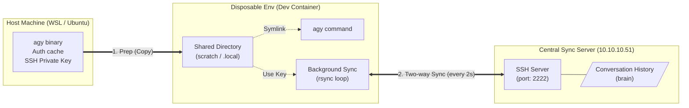

# agy-cli-sync

A project for two-way synchronization of `antigravity-CLI` (agy) configuration files and conversation history between a disposable environment (such as a Dev Container) and a central server.

By using the scripts in this repository, you can retain your past conversation history (brain) and continue using `agy` seamlessly, even if you rebuild your container.

> **Environment Assumptions**
> To allow anyone to reproduce this setup, this document uses the sync server IP address `10.10.10.51` and SSH port `2222`. Please adjust these values according to your actual environment.

---

## 0. Preparation: Create an SSH Key for Sync

To securely synchronize data between the server and the container, create a dedicated SSH key pair.
Run the following command in your host machine's terminal (e.g., WSL, Ubuntu) to generate the key. (Leave the passphrase empty).

```bash
ssh-keygen -t ed25519 -f ~/.ssh/agy_key -N ""

```

This will generate a private key (`~/.ssh/agy_key`) and a public key (`~/.ssh/agy_key.pub`).
Display the contents of the public key and copy it.

```bash
cat ~/.ssh/agy_key.pub
# Example output: ssh-ed25519 AAAAC3Nza... (string specific to your environment)

```

---

## 1. Server-side Setup

Set up an SSH server container on your server (`10.10.10.51`) to receive and store the conversation data.

Place the `docker-compose.yml` included in this repository on your server.
**Before starting, replace the `PUBLIC_KEY` value with "your public key" copied in Step 0.**

Once modified, start the container.
*Note: Upon startup, the `agysync` user is automatically created and the public key is registered.*

```bash
docker-compose up -d

```

---

## 2. Client-side Preparation (Host side: WSL / Ubuntu, etc.)

To use `agy` from within the container, you need to copy your user-specific files and the private key created earlier to a shared directory accessible by the container (e.g., a `.local/` directory inside your project).

Place the following files in the shared directory using your host's terminal. (*Adjust the paths to match your environment.*)

```bash
# 1. Create a directory for sharing
mkdir -p /path/to/project/.local/.gemini

# 2. Copy the agy binary
cp ~/.local/bin/agy /path/to/project/.local/agy

# 3. Copy login state (authentication cache)
cp -r ~/.gemini/antigravity-cli /path/to/project/.local/.gemini/

# 4. Copy the "private key" created in Step 0
cp ~/.ssh/agy_key /path/to/project/.local/agy_key

```

*Note: Ensure that the setup scripts from this repository (`setup-agy-init.sh`, `setup-agy-start.sh`) are also placed in a location accessible from inside the container.*

---

## 3. Container Setup and Sync Initialization

Once attached to your container environment (like a Dev Container), run the setup script included in this repository to start the synchronization.
Execute one of the following scripts depending on your situation:

### A. On Initial Container Build

This script creates symlinks for the binary and credentials, installs `rsync`, performs the initial pull, and starts the continuous background sync process (every 2 seconds).

```bash
bash /path/to/setup-agy-init.sh

```

### B. On Subsequent Container Starts

Use this when restarting a container where `rsync` is already installed. This script simply re-verifies the links and starts the sync process.

```bash
bash /path/to/setup-agy-start.sh

```

---
## System configuration


## 💡 Verification

After running the script, you can verify if everything is working correctly with the following commands:

```bash
# Check if the agy command is recognized
agy --version

# Check if the sync process (rsync) is running in the background
ps aux | grep rsync

```
